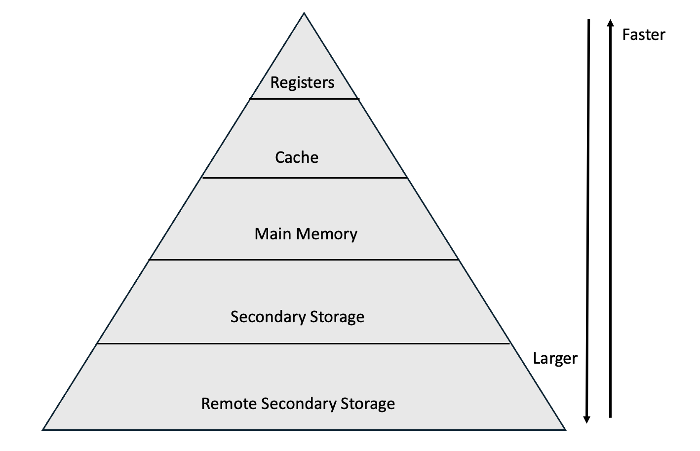

# 컴퓨터구조

# 컴퓨터구조와 개요 (Introduction to Computer Architecture)

## 컴퓨터 구조란 무엇인가?

**컴퓨터 구조(Computer Architecture)**

- **정의**: 
  - 컴퓨터 시스템의 기능, 조직, 구현에 대한 법칙과 방법
  - 컴퓨터 시스템의 구성 요소와 그들 간의 상호 작용을 설명하는 개념으로, 하드웨어와 소프트웨어의 상호 작용을 포함

## 컴퓨터 시스템의 발전과 역사

1. 초기 계산 기계 (1940년대 이전)
   - 아날로그 컴퓨터를 사용함

2. 최초의 전자 컴퓨터 (1940년대)
   - ENIAC (Electronic Numerical Integrator and Computer): 세계 최초의 범용 전자 컴퓨터
   - 크기와 전력소모가 매우 컸고, 유지보수가 어려움

3. 트랜지스터와 통합 회로의 시대 (1950년대~1960년대)
   - 진공관을 대체한 트랜지스터를 사용한 컴퓨터 개발
   - IC회로의 도입으로 성능과 효율이 대폭 증가함

4. 미니컴퓨터와 개인용 컴퓨터의 발전 (1970년대)
   - 개인용 컴퓨터(PC, Personnal Computer)를 도입함
   - Intel 4004: 최초의 상용 마이크로프로세서

5. 네트워킹과 인터넷의 발전 (1980년대)
    - LAN(Local Area Network)을 통해 인터넷 상용화함

6.  모바일 컴퓨팅과 클라우드 컴퓨팅 (2000년대)
    - 모바일 장치 및 클라우드 컴퓨팅으로 어디서나 데이터에 접근할 수 있음

7.  인공지능과 머신러닝의 발전 (2010년대~현재)
    - 머신러닝과 딥러닝 기술의 발전으로 컴퓨터가 데이터를 학습하고 패턴을 인식함
    - 초고밀도 집적회로(VLSI)를 사용하여 초소형화, 초고속화가 이루어짐

## 컴퓨터의 구성 요소 (Components of a Computer System)

**중앙처리장치(CPU)**

> CPU 내부 구조
- **정의**: 
  - 컴퓨터 시스템의 두뇌 역할을 하며, 명령어를 해석하고 실행함
- **특징**: 
  - 컴퓨터 시스템의 핵심 구성 요소임
  - 데이터의 처리와 명령어의 실행을 담당함
  - 크게 산술 논리 장치, 제어 유닛, 레지스터로 구성됨 
  - 명령어의 사이클을 통해 순서대로 명령어를 실행함
**메모리(Memory)**

- **정의**: 
  - 컴퓨터 시스템 내에서 데이터와 명령어를 저장하고, 필요할 때 접근할 수 있도록 하는 하드웨어 장치
- **특징**:
  - 주기억장치(Primary memory)와 보조기억장치(Secondary Storage)로 구분됨
    - 주기억장치(Primary memory)
      - ROM(Read Only Memory) - 컴퓨터 전원이 끊어져도 기록된 데이터들이 소멸하지 않는 비휘발성 메모리로, BIOS와 같은 주요 데이터를 저장한다
      - RAM(Random Access Memory) - 전원이 끊어지면 기록된 데이터들이 소멸하는 휘발성 메모리이며, 읽고 쓰기가 가능함   

    - 보조기억장치(Secondary Storage)
      - HDD(Hard Disk Drive) - 자기 디스크를 사용해 데이터를 저장하는 장치, 회전하는 플래터와 읽기/쓰기 헤더를 이용함
      - SDD(Solid State Drive) - 반도체를 이용하여 데이터를 저장하는 장치, 플래시 메모리를 사용하고, HDD와 비교해 작교 가벼우며 처리 속도가 빠름
      - USB(Universal Serial Bus) - USB 포트에 꽂아 사용하는 이동형 저장장치, 플래시 메모리를 사용함  
  - 메모리 계층 구조
    
    > 메모리 계층 구조도
    - 필요에 따라 여러 종류의 메모리를 나눠 CPU가 순차적으로 액세스 함으로써 최적의 효율을 낼 수 있게 하는 구조
    - 계층 위로 올라갈 수록 접근 속도가 빠르고 저장 용량이 적어짐
    - 지역성의 원리(Principle of Locality)
      - 메모리는 지역성의 원리를 이용하여 계층적으로 구성
    - 시간적 지역성(Temporal locality)
      - 어떤 데이터가 참조되면 곧바로 다시 참조될 가능성이 높다는 원칙
    - 공간적 지역성(Spatial locality)
      - 어떤 데이터가 참조되면 곧바로 그 주위의 데이터가 참조될 가능성이 높다는 원칙

  1. 레지스터(Register)
    - CPU 내부에 위치한 가장 빠른 메모리로, CPU가 직접 접근할 수 있는 소량의 데이터 저장소
    - 매우 빠른 접근 속도를 가지고 용량이 작음
  2. 캐시 메모리(Cache Memory)
      - CPU 내부에 위치한 가장 빠른 메모리로, CPU가 직접 접근할 수 있는 소량의 데이터 저장소
      - 매우 빠른 접근 속도를 가지고 용량이 작음
  3. 주 메모리(Main Memory)
      - 주로 DRAM(Dynamic Random Access Memory)으로 구성되어 있으며, 프로그램과 데이터를 일시적으로 저장
      - 접근 속도는 캐시보다 느리고, 전원이 꺼지면 데이터가 사라짐
  4. 보조 저장 장치(Secondary Storage)
      - 데이터를 영구적으로 저장하는 장치로, HDD, SSD, Flash Disk 등이 있음
      - 접근 속도가 느리고, 대용량 데이터를 저장할 수 있음
      - 비휘발성 메모리로 전원이 꺼져도 데이터가 유지됨
  5. 원격 보조 저장장치(Remote Secondary Storage)
      - 클라우드 스토리지나 외부 저장 장치 등으로, 주로 데이터 백업이나 아카이빙에 사용됨
      - 접근 속도가 가장 느리고, 일반적으로 인터넷을 통해 접근함

**입출력 장치 (I/O Devices)**

>I/O 장치의 기본 작동 원리
- **정의**: 
  - 컴퓨터 시스템과 외부 환경 간의 데이터 교환을 가능하게 하는 하드웨어 장치
- **특징**: 
  - 입력 장치 - 키보드, 마우스, 터치스크린, 스캐너 등
  - 출력 장치 - 모니터, 프린터, 스피커 등
  - 입출력 장치 - 터치스크린, 모뎀, 네트워크 카드, 외장 하드 등

## 폰노이만 아키텍처 (Von Neumann Architecture) vs. 하버드 아키텍처 (Harvard Architecture)

**폰노이만 아키텍처 (Von Neumann Architecture)**


>폰 노이만 아키텍처 데이터 교환 방식 및 내부 구조
- **정의**: 
  - 프로그램과 데이터를 동일한 메모리에 저장하고, CPU가 메모리에서 명령어를 순차적으로 가져와 실행하는 컴퓨터 설계 모델
- **특징**:
  - 프로그램과 데이터를 동일한 메모리에 저장함으로써, 프로그램의 수정과 데이터의 접근이 용이
  - 명령어를 순차적으로 처리함으로써, 프로그램의 흐름을 예측 가능하게 함
  - 한 번에 하나의 명령어만 실행 가능함
  - 하나의 메모리를 공유함
- **장점**: 
  - 공용 메모리 사용을 구현 비용이 상대적으로 저렴함
- **단점**: 
  - 파이프라이닝 시 메모리 공유 문제 발생함
  - 한 번에 하나의 명령어만 처리하므로 CPU를 비효율적으로 사용함

**하버드 아키텍처 (Harvard Architecture)**

>하버드 아키텍처 데이터 교환 방식 및 내부 구조
- **정의**: 
  - 명령어와 데이터를 별도의 메모리 공간에 저장하고, 독립적인 버스를 통해 접근하는 컴퓨터 설계 모델
- **특징**: 
  - 파이프라인 구현을 위해, 명령어와 데이터를 별도의 메모리 공간에 저장함
  - 동시에 명령어 해석과 저장이 가능함
- **장점**: 
  - 명령어와 데이터에 동시 접근 가능하여 처리 속도 향상
  - 명령어와 데이터가 동일한 버스를 공유하지 않아 충돌 문제가 발생하지 않음
- **단점**: 
  - 메모리와 버스를 별도로 설계해야 하므로 하드웨어가 복잡함
  - 추가적인 메모리와 버스 설계로 인해 비용이 높아짐

## 컴퓨터 설계의 기본 원리 (Fundamental Principles of Computer Design)

**관심사 분리(Separation Of Concerns)**

- **정의**: 
  - 시스템이나 소프트웨어에서 각기 다른 기능이나 문제를 독립적으로 처리하도록 나누는 설계 원칙
- **특징**: 
  - 유지보수와 확장성이 용이함
  - 각 모듈은 독립적으로 변경, 개발이 가능함

**캡슐화와 추상화(Encapsulation and Abstraction)**

- **정의**: 
  - 캡슐화는 객체나 클래스의 내부 구현을 외부에서 숨기고, 필요한 기능만을 공개하는 원리
  - 추사오하는 복잡한 시스템에서 중요하지 않거나 세부사항을 제거하고, 핵심 기능만을 드러내는 원리
- **특징**: 
  - 캡슐화는 데이터와 그 데이터를 처리하는 메서드를 하나의 단위로 묶어 객체로 구현함
  - 추상화는 사용자가 시스템을 사용할 때 불필요한 세부사항을 몰라도 되게 하여, 복잡성을 줄이고 사용성을 높임

**느슨한 결합과 높은 응집력(Loose Coupling and High Cohesion)**

- **정의**: 
  - 느슨한 결합은 시스템의 각 모듈이나 컴포넌트들이 서로 의존성을 최소화하여 독립적으로 작동하는 것
  - 높은 응집력은 모듈 내의 구성 요소들이 하나의 관련된 작업을 수행하도록 하는 원리
- **특징**: 
  - 느슨한 결합은 모듈 간의 의존도가 낮아 수정이나 교체가 용이하고, 시스템의 유연성과 확장성을 높임
  - 높은 응집력은 한 모듈이 하나의 책임만을 가지므로 유지보수 및 테스트가 용이함

**확장성 및 성능(Scalability and Performance)**

- **정의**: 
  - 확장성은 시스템이 커지거나 부하가 증가할 때 성능이나 처리 능력을 추가하여 확장할 수 있는 능력을 의미함
  - 성능은 시스템이 주어진 작업을 얼마나 효율적으로 처리할 수 있는지에 대한 측정하는 것임
- **특징**:
  - 시스템이 높은 트래픽이나 처리 요구 사항을 처리할 수 있도록 확장하는 데 필요한 자원이나 방법을 설계하여 확장성을 고려함
  - 시스템이 최대한 빠르고 효율적으로 작업을 처리하도록 최적화하여 성능을 고려함

**회복성과 내결함성(Resilience to Fault Tolerance)**

- **정의**: 
  - 회복성은 시스템이 고장이나 오류 상황에서 얼마나 잘 회복할 수 있는지를 의미하고, 내결함성은 시스템이 오류가 발생해도 지속적으로 정상 동작을 할 수 있도록 설계하는 능력
- **특징**: 
  - 시스템이 장애에 강하게 설계되어 있으며, 장애가 발생하더라도 복구 절차가 마련되어 있어 서비스 중단을 최소화할 수 있음
  - 

**개인정보 보호 및 보안(Security and Privacy)**

- **정의**: 
  - 보안은 시스템과 데이터를 외부 공격이나 침해로부터 보호하는 기술과 절차를 의미함
- **특징**: 
  - 시스템은 비인가 접근을 방지하고, 데이터의 무결성과 기밀성을 보장함
  - 개인정보 보호를 위해서는 암호화, 익명화, 접근 제어 등의 방법을 통해 개인 정보를 보호함


# 명령어 집합 구조(ISA, Instruction Set Architecture)

## CISC (Complex Instruction Set Computer)

- **정의**: 
  - 복잡하고 다양한 명령어를 포함하는 명령어 집합 구조를 가진 컴퓨터 아키텍처
- **특징**: 
  - 가변 길이 명령어를 가질 수 있어 명령어의 복잡성과 다양성을 증가시킴, 이를 통해 더 많은 기능을 하나의 명령어로 구현
  - 다양한 주소 지정 방식을 지원하여 데이터 접근 방법의 유언성을 제공하고, 복잡한 데이터 구조를 쉽게 처리 가능함

- **장점**: 
  - 복잡한 명령어를 사용하여 작업을 수행하는데 필요한 명령어 수가 줄어들어 코드의 밀도가 높아질 수 있음
  - 많은 기능을 하나의 명령어로 구현할 수 있어, 하드웨어의 복잡성을 숨기고 추상화된 인터페이스를 제공할 수 있음

- **단점**: 
  - 복잡한 명령어 집합과 마이크로코드의 사용으로 CPU설계가 복잡해짐
  - 명렁어가 복잡하고 길이가 가변적이기 때문에, 효율적인 파이프라이닝을 구현하기 어려움
  - 하드웨어가 복잡한 명령어를 처리해야 하기 때문에, RISC에 비해 명령어의 실행 속도가 느림

- **활용 예시**: 
  - Intel x86 아키텍처 CPU, AMD x86 호환 CPU, 모토로라 68000 시리즈, IBM 메인프레임 CPU 등

## RISC (Reduced Instruction Set Computer)

- **정의**: 
  - 단순하고 고속의 명령어 집합을 사용하는 컴퓨터 아키텍처
- **특징**: 
  - 명령어의 복잡성을 줄여 단순한 구조로 설계되고, 명령어 길이가 고정되어 있음
  - 레지스터를 적극적으로 사용하여 메모리 접근을 최소화 함
  - 데이터 메모리에 접근하는 명령어(로드/스토어)와 데이터 레지스터간의 연산을 분리하여 처리함
  
- **장점**: 
  - 단순하고 고정된 명령어 구조로, 파이프라이닝을 효과적으로 구현할 수 있음
  - 복잡한 명령어 처리가 필요 없기 때문에, 전력 소비가 적고, 에너지 효율성이 높아 모바일 및 임베디드 시스템에 적합함

- **단점**: 
  - 하나의 복잡한 명령어를 여러 단순한 명령어로 구현해야 하기 때문에, 전체 명령어 수가 증가하여 코드의 길이가 길어질 수 있음
  - 데이터 메모리에 접근하는 명령어가 별도로 존재하기 때문에, 복잡한 메모리 연산을 직접 지원하지 않음
  - 많은 레지스터를 필요로 해서 하드웨어 설계가 복잡하고, 레지스터 수가 제한적일 경우 성능 저하로 이어질 수 있음

- **활용 예시**: 
  - Apple A시리즈 칩, Qualcomm Snapdragon 시리즈, AWS Graviton 프로세서 등

# 데이터 표현 및 연산 (Data Representation and Operations)

## 수의 체계 (Number Systems)
- 컴퓨터는 우리가 흔히 일생상활에서 사용하는 10진수가 아닌, 2진수, 8진수와 16진수를 사용
- 컴퓨터는 전자 신호의 ON(1)과 OFF(0) 상태를 기반으로 작동하기 때문에 2진법 기반의 숫자 체계를 사용

### 이진수(Binary), 8진수(Octal), 16진수(Hexadecimal) 표현

**이진수(Binary)**

- **정의**: 
  - 0과 1 두 가지 숫자만을 사용하여 수를 표현하는 체계
- **특징**: 
  - 각 자릿수가 하나의 bit이며, 2의 거듭제곱수를 나타냄
  - $n$개 자릿수를 가진 이진수라면 $2^0$부터 시작하여 $2^{n-1}$까지가 각 자릿수에 대응함
- **활용 예시**: 
  - 2진수 $1001$을 10진수로 변환하면 $1*2^3 + 0*2^2 + 0*2^1 + 1*2^0$으로 $9$
  - 10진수 $7$을 2진수로 변환하면 $1*2^2 + 1*2^1 + 1*2^0$이므로 $111₂$

**8진수(Octal)**

- **정의**: 
  - 0부터 7까지 8개의 숫자를 사용하여 수를 표현하는 체계
- **특징**: 
  - 8진수 한 자릿수가 2진수 3bit와 대응하며, 8의 거듭제곱수를 나타냄
  - $n$개 자릿수를 가진 8진수라면 $8^0$부터 시작하여 $8^{n-1}$까지가 각 자릿수에 대응함
- **활용 예시**: 
  - 8진수 $101$을 10진수로 변환하면 $1*8^2 + 0*8^1 + 1*8^0$으로 $65$
  - 10진수 $18$을 8진수로 변환하면 $2*8^1 + 2*8^0$이므로 $22₈$

**16진수(Hexadecimal)**

- **정의**: 
  - 0부터 9까지와 A부터 F(A : 10 ~ F : 15)까지 6개의 문자, 총 16개의 숫자로 수를 표현하는 체계
- **특징**: 
  - 각 자릿수가 2진수 4bit에 대응하며, 16의 거듭제곱수를 나타냄
  - $n$개 자릿수를 가진 16진수라면 $16^0$부터 시작하여 $16^{n-1}$까지가 각 자릿수에 대응함
- **활용 예시**: 
  - 16진수 FA를 10진수로 변환하면 $F(15)*16^1 + A(10)*16^0$으로 $250₁₆$
  - 10진수 $720$를 16진수로 변환하면 $2*16^2 + D(13)*16^1 + 0*16^0$이므로 $2D0₁₆$


### 체계 간 변환

**2진수 - 8진수 변환**
  - 8진수의 한 자리가 2진수의 3bit에 대응하므로 2진수를 오른쪽부터 세자리씩 끊어서 8진수로 변환한 후 순서대로 결합
  - 8진수를 2진수로 변환할때는 8진수 한 자리를 2진수 3bit로 변환한 후 순서대로 결합
  - 예시
    - 2진수 $1 101 011$을 8진수로 변환하면 $001 | 101 | 011$ -> $1 | 5 | 3$ 이므로 $153$
    - 8진수 $161$을 2진수로 변환하면 $1 | 6 | 1$ -> $001 | 110 | 001$ 이므로 $1110001$

**2진수 - 16진수 변환**
  - 16진수의 한 자리가 2진수의 4bit에 대응하므로 2진수를 오른쪽부터 네자리씩 끊어서 16진수로 변환한 후 순서대로 결합
  - 16진수를 2진수로 변환할때는 16진수 한 자리를 2진수 4bit로 변환한 후 순서대로 결합
  - 예시 
    -  2진수 $111 0010 1001$을 16진수로 변환하면 $0111|0010|1001$ -> $7|2|9$이므로 $729$
    -  16진수 $C A 8$을 2진수로 변환하면 $C|A|8$ -> $1101|1010|1000$이므로 $110110101000$

**8진수 - 16진수 변환**
- 8진수에서 16진수로 변환할때는, 8진수를 2진수로 변환 후 16진수로 변환
- 16진수를 8진수로 변환할때는, 16진수를 2진수로 변환 후 8진수로 변환


## 정수와 실수 표현 (Integer and Floating-Point Representation)

**정수(Integer)**

- **정의**: 
  - 숫자를 표현하기 위한 데이터 타입 중 하나로, 소수점 없는 숫자를 저장하고 처리함
- **특징**: 
  - 양의 정수, 음의 정수, 그리고 0을 포함함

**실수(Real Number)**

- **정의**: 
  - 소수점 이하의 값을 포함할 수 있는 숫자 집합임
- **특징**: 
  - 유리수(rational number)와 무리수(irrational number)를 포함하는 수의 집합임

### 고정소수점과 부동소수점

**고정소수점 (Fixed Point)**

- **정의**: 
  - 소수점의 위치가 고정되어 있는 숫자 표현 방식
- **특징**: 
  - 부호 비트와 정수 부분을 나타내는 정수부, 소수 부분을 나타내는 소수부로 구성됨
  - 고정된 자리 수로 인해 특정 숫자를 정확하게 표현할 수 있음
- **장점**: 
  - 소수점 위치가 고정되어 있어 연산이 단순하고, 복잡한 부동소수점 유닛이 필요하지 않아 부동소수점에 비해 연산이 빠름
  - 정수부와 소수부의 비트 수가 고정되어 있기 때문에, 메모리 사용이 예측 가능하고 최적화 될 수 있음
- **단점**: 
  - 표현할 수 있는 숫자의 범위가 좁아서 큰 숫자나 소수를 표현하기 어려움
  - 부동소수점에 비해 소수부 정밀도가 낮음
- **활용 예시**: 
  - 고정 소수점의 소수부 구하는 법
    - 10진수를 2진수로 변환하는 방법의 반대로 2를 곱해가며 나머지를 구해 결합함
      - $0.625$를 2진수로 변환하기
        - $0.625 * 2 = 1.25$ -> 나머지 $1$을 제외하고 다음 계산함
        - $0.25 * 2 = 0.5$ -> 나머지 $0$을 제외하고 다음 계산함
        - $0.5 * 2 = 1$ -> 나머지 $1$을 제외함
        - 0.625의 고정소수점 변환 소수부는 $101$

**부동소수점 (Floating Point)**

- **정의**: 
  - 소수점 위치가 고정되어 있지 않고, 숫자의 크기에 따라 소수점 위치가 이동하는 표현 방식
- **특징**: 
  - 부호 비트와 지수를 나타내는 지수부, 소수점 아래를 나타내는 가수부로 구성됨
  - 부동소수점 수는 항상 정규화(Normalization)된 형태로 표현 - 가수가 1.F형태를 가지도록 조정되어 표현함
  - IEEE 754 표준을 통해 32비트(단정도, Single Precision), 64비트(배정도, Double Precision)를 사용하여 실수를 표현함
  - 지수부에 bias를 더하여 지수부가 10진수 기준으로 0~127구간은 음수, 128~255구간은 양수를 나타내어 음의 지수를 표현함
- **동작 방식**: 
- **장점**: 
  - 소수점 위치를 조정함으로써, 매우 큰 수부터 매우 작은 수까지 표현 가능함
  - 높은 정밀도를 가져 복잡한 수학적 연산이나 데이터 분석에서 고정소수점에 비해 정확한 결과를 얻을 수 있음
  - IEEE 754표준을 통해 부동소수점 연산의 일관성을 보장하여, 다양한 컴퓨터 시스템과 프로그래밍 언어 간 호환성이 높음
- **단점**: 
  - 고정소수점 연산에 비해 복잡하고 많은 자원을 소모할 수 있음
  - 유한한 비트 수로 실수를 표현하기 때문에, 모든 실수를 정확하게 표현할 수 없음
- **활용 예시**: 
  - $6.5$를 단정도 부동소수점으로 변환 - 1비트는 부호 비트로 사용, 지수부 8비트, 가수부 23비트로 구성
    - $6$ -> $110$
    - $0.5$ -> $1$
    - $6.5$ -> $110.1$
    - 정규화하여 $1.101 * 2^2$
    - 양수이므로 부호 비트는 0, 지수가 양수이므로 bias를 더하고 오른쪽부터, 가수부는 소수점 아래를 왼쪽부터 채워 $0 | 10000001 | 10100000000000000000000$으로 표현(정수 1은 모든 부동소수점 표현에서 같이 존재하므로 무시)


### IEEE 754 표준 (IEEE 754 Standard) - 표현, 정밀도, 반올림

**IEEE 754 표준 (IEEE 754 Standard)**

- **정의**: 
  - 컴퓨터에서 부동소수점 수를 표현하고 연산하는 방식을 규정한 국제 표준
- **특징**: 
  - 부동소수점을 단정도와 배정도 두 가지 형식으로 정의함
    - 단정도(Single Precision, 32bit)
      - 부호 비트 1비트, 지수 비트 8비트, 가수 비트 23비트
    - 배정도(Double Precision, 64bit)
      - 부호 비트 1비트, 지수 비트 11비트, 가수 비트 52비트
  - 특수 값을 따로 정의 하여 특수한 상황을 처리
    - Zero
      - 양의 제로 - 부호 비트 0, 지수 비트 모두 0, 가수 비트 모두 0
      - 음의 제로 - 부호 비트 1, 지수 비트 모두 0, 가수 비트 모두 0
    - Infinity
      - 양의 무한대 - 부호 비트 0, 지수 비트 모두 1, 가수 비트 모두 0
      - 음의 무한대 - 부호 비트 1, 지수 비트 모두 1, 가수 비트 모두 0
    - NaN(Not a Number)
      - 지수 비트 모두 1, 가수 비트 모두 0

**정밀도**

- **정의**: 
  - 부동소수점 수가 얼마나 정확하게 실수를 표현할 수 있는가를 나타냄
- **특징**: 
  - IEEE 754 표준에서는 단정도와 배정도로 정밀도를 구분함
    - 단정도
      - 가수 비트 23비트로 약 7자리 십진수를 표현 가능
    - 배정도
      - 가수 비트 52비트로 약 16자리 십진수를 표현 가능

**반올림**

- **정의**: 
  - 부동 소수점 연산에서 발생할 수 있는 반올림을 다루기 위한 다양한 방법
- **특징**:
  - 부동 소수점 연산의 결과가 표현 가능한 정밀도를 초과할 때 사용함
  - 연산 결과가 가수부의 비트를 초과할 때 반올림 모드를 이용해 연산 결과를 표현
  - IEEE 754에서는 round to nearest, ties to even을 기본값으로 사용

  - 반올림 모드(Rounding mode)
    - 짝수로 반올림(round to nearest, ties to even)
      - 반올림하려는 수의 소수부분이 정확히 0.5일 경우, 소수부분의 앞 자리 정수가 짝수인 경우 가장 가까운 작은 정수로 반올림, 앞자리 숫자가 홀수라면 가장 가까운 큰 정수로 반올림
      - $4.5$의 반올림은 $4$, $5.5$의 반올림은 $6$
    - 큰 절댓값으로 반올림(round to nearest, ties away from zero)
      - 반올림하려는 수의 소수부분이 정확히 0.5일 경우, 소수부분의 앞 자리 정수에 관계없이 가장 가까운 정수 쪽으로 반올림
      - $4.5$의 반올림은 $5$, $5.5$의 반올림은 $6$
    - 올림(round toward +∞)
      - 반올림하려는 수가 양의 무한대에 가까워지는 경우, 해당 양의 무한대 값을 반올림 결과로 사용(가장 가까운 큰 정수)
      - $3.2$의 반올림은 $4$, $5.7$의 반올림은 $6$
    - 버림(round toward -∞)
      - 반올림하려는 수가 음의 무한대에 가까워지는 경우, 해당 음의 무한대 값을 반올림 결과로 사용(가장 가까운 작은 정수)
      - $3.7$의 반올림은 $3$, $-2.8$의 반올림은 $-3$
    - 절삭(round toward zero)
      - 반올림하려는 수의 소수 부분을 무시하고, 가장 가까운 정수로 반올림
      - $2.9$의 반올림은 $2$, $-2.9$의 반올림은 $-2$

## 데이터 연산 (Data Operations)

### 산술 연산 (Arithmetic Operations)

**산술 연산 (Arithmetic Operations)**

- **정의**: 
  - 숫자에 대한 기본적인 수학적 연산으로, 일반적으로 정수 및 부동 소수점 수에 대해 수행됨
- **특징**: 
  - 기본적인 사칙연산 덧셈, 뺄셈, 곱셈, 나눗셈을 수행함
  - 오버플로우, 언더플로우와 같은 문제를 처리하기 위한 추가적인 논리가 필요함
- **동작 예시**:
- 종류
  - 덧셈(+)
    - 두 숫자를 더하는 연산
    - $3 + 5 = 8$
  - 뺄셈(-)
    - 한 숫자에서 다른 숫자를 빼는 연산
    - $5 - 3 = 2$
  - 곱셈(*)
    - 두 숫자를 곱하는 연산
    - $3 * 5 = 15$
  - 나눗셈(/)
    - 한 숫자를 다른 숫자로 나누는 연산
    - $15 / 3 = 5$
  - 모듈로 연산(%)
    - 한 숫자를 다른 숫자로 나누고 나머지를 구하는 연산
    - $20 \% 3 = 2$ 
- **장점**: 
  - 다양한 분야에서 활용 가능함
  - 복잡한 수학적 문제도 해결 가능함
- **단점**: 
  - 보동 소수점 연산에서 정밀도 문제가 존재함
  - 오버플로우 및 언더플로우 발생 가능성이 존재함
- **활용 예시**: 
  - 수학적 계산

### 논리 연산 (Logical Operations)

**논리 연산 (Logical Operations)**

- **정의**: 
  - Boolean 데이터를 처리하는 연산으로 조건 판단에 주로 사용함
- **특징**: 
  - 비트에 적용하여 비트 연산(Bitwise Operations)으로 사용함
  - 비트에서 참(True)는 1, 거짓(False)는 0으로 표현함
  - 단일 클록 주기 내에 처리될 수 있음
- **동작 예시**: 
  - 논리곱(AND)
    - 두 논리값이 모두 참일 때만 참을 반환
    - True AND False = False
    - True AND True = True
  - 논리합(OR)
    - 두 논리값 중 하나라도 참일 때 참을 반환
    - True OR False = True
  - 부정(NOT)
    - 논리값을 반대로 반환
    - NOT True = False
  - 배타적 논리합(XOR, Exclusive OR)
    - 두 값이 서로 다를 때 참을 반환
    - True XOR True = False
    - True XOR False = True
  - 부정 논리곱(NAND)
    - 논리곱 연산의 결과를 반대로 반환
    - True NAND False = True
    - True NAND True = False
  - 부정 논리합(NOR)
    - 논리합 연산의 결과를 반대로 반환
    - True NOR False = False
- **장점**: 
  - 연산 속도가 매우 빠름
  - 비트 마스크와 결합하여 효율적인 비트 단위의 데이터 처리가 가능함
- **단점**:
  - 복잡한 수학적 계산에는 한계가 있음
- **활용 예시**: 
  - 비트 마스크 설정, 해제, 검사

### 시프트 연산 (Shift Operations)

**시프트 연산 (Shift Operations)**

- **정의**: 
  - 2진수로 표현된 데이터를 특정 방향으로 일정한 비트 수만큼 이동시키는 연산
- **특징**: 
  - 2의 제곱수로 곱하거나 나누는 연산을 빠르게 수행할 수 있고, 특정 비트를 추출하거나 설정할 때 사용
  - 크게 논리 시프트, 산술 시프트, 순환 시프트로 나뉨
- **동작 예시**: 
  - 논리 시프트(Logical Shift)
    - 비트를 단순히 왼쪽이나 오른쪽으로 이동시키고, 이동한 자리에 0을 채우는 연산
    - 부호 비트를 유지하지 않아 주로 Unsigned 데이터에서 사용
    - 논리 시프트 왼쪽(Logical Shift Left, LSL) - Unsinged
      - 데이터를 왼쪽으로 이동시키고, 오른쪽 끝에 0을 채움
      - $69 << 1 = 138$ -> ($01000101$ -> $10001010$)
    - 논리 시프트 오른쪽(Logical Shift Right, LSR) - Unsinged
      - 데이터를 오른쪽으로 이동시키고, 오른쪽 끝에 0을 채움
      - $22 >> 1 = 11$ -> ($00010110$ -> $00001011$)
  - 산술 시프트(Arithmetic Shift)
    - 부호 비트를 유지하면서 비트를 이동시키는 연산
    - 주로 Signed 데이터에서 사용하며, 2의 거듭제곱수를 곱하거나 나누는데 사용
    - 산술 시프트 왼쪽(Arithmetic Shift Left, ASL) - 부호 절댓값 표현
      - $-33 << 1 = -66$ -> ($10100001$ -> $11000010$)
    - 산술 시프트 오른쪽(Arithmetic Shift Right, ASR) - 부호 절댓값 표현
      - $-33 >> 1 = -16$ -> ($10100001$ -> $10010000$)
  - 순환 시프트(Circular Shift)
    - 이동되어 제거된 비트가 다시 반대쪽 끝으로 순환되어 돌아오는 연산
    - 순환 시프트 왼쪽(Circular Shift Left, CSL) - Unsinged
      - $149 << 1 = 43$ -> ($10010101$ -> $00101011$)
    - 순환 시프트 오른쪽(Circular Shift Right, CSR) - Unsinged
      - $139 >> 1 = 197$ -> ($10001011$ -> $11000101$)
- **장점**: 
  - 하드웨어에서 산술 연산을 매우 빠르게 수행할 수 있음
  - 배수 및 나누기 연산에 특화되어, 효율적이고 빠른 계산 가능함
- **단점**: 
  - 연산 시 오버플로우 문제가 발생 할 수 있음
- **활용 예시**: 
  - 비트 마스크 및 플래그 설정
  - Gray 코드 변환

## Signed vs Unsigned 데이터

**Signed Data**

- **정의**: 
  - 양수와 음수 둘 다 표현할 수 있는 데이터 타입으로, 최상위 비트(MSB, Most Significant Bit)를 부호 비트로 사용하여 숫자의 부호를 표현
- **특징**: 
  - N비트의 signed 정수는 $-2^N \sim 2^N -1$ 까지의 수를 표현할 수 있음
  - 부호 비트 0은 양수, 1은 음수를 표현함
  - 3가지 음수 표현 방식이 존재함

    - 부호-절댓값(Sign-Magnitude)
      - 정수의 부호(Sign)와 크기(Magnitude)를 별도로 저장하는 방식임
      - 부호 비트 1비트를 제외한 나머지 비트에 절댓값을 2진수로 표현함
      - $+5$ -> $0 | 0000101₂$
      - $-5$ -> $1 | 0000101₂$
    - 1의 보수(One's Complement)
      - 음수를 표현하기 위해 양수의 모든 비트를 반전시키는 방식임
      - $+5$ -> $00000101₂$
      - $-5$ -> $11111010₂$
    - 2의 보수(Two's Complement)
      - 음수를 표현하기 위해 양수의 1의 보수에 1을 더하는 방식임
      - 현대의 대부분의 컴퓨터 시스템에서 사용
      - $+5$ -> $00000101₂$ 
      - $-5$ -> $11111011₂$ 

**Unsigned Data**

- **정의**:
  - 양수와 0만을 표현할 수 있는 데이터 타입
- **특징**:
  - N비트의 Unsigned 정수는 $0 \sim 2^N -1$까지의 수를 표현할 수 있음
  - 모든 비트를 숫자의 절댓값을 표현하는데 사용해, 동일한 비트 수에서 Signed보다 더 큰 양수를 표현할 수 있음
-  **예시**:
   - $11111101₂$는 253을 나타냄

## 중앙처리장치 (CPU)
- 역할:
   - 컴퓨터 시스템의 두뇌 역할을 하며, 명령어를 해석하고 실행
   - 산술 연산, 논리 연산, 데이터 이동, 제어 신호 생성 등을 담당 
### CPU의 구조와 구성 요소

> 위 그림은 제어장치, 연산장치, ALU, 레지스터, 내부 버스로 구성되어 있는 CPU를 보여줌 


#### 1. 연산 장치 (ALU: Arithmetic Logic Unit):
- 정의: 산술 연산과 논리 연산 등을 수행
- 역할: 입력된 데이터에 대해 연산을 수행하고, 그 결과를 레지스터로 전달하거나 메모리에 저장
- 구성: 가산기, 보수기, 누산기 , 데이터 레지스터 등


> 위 그림은 ALU가 정수 피연산자와 연산 명령(Opcode)을 입력으로 받아 산술 및 논리 연산을 수행하고, 연산 결과와 상태 플래그를 출력하는 동작 과정을 나타냄


#### 2. 제어 장치 (CU: Control Unit):
- 정의: 프로그램 명령을 해석하고 실행 순서를 제어
- 역할: 기억 장치로부터 명령을 순차적으로 꺼내 해독하고, 해석에 따라 명령어 실행에 필요한 제어 신호를 기억 장치, 연산 장치, 입출력 장치 등으로 보내는 장치 
- 구성: 프로그램 카운터(PC), 명령 해독기, 부호기, 명령 레지스터 등


> 위 그림은 CU가 플래그 레지스터와 명령 레지스터에서 입력 신호를 받아, clock에 따라 명령을 해석한 뒤, 레지스터, ALU, 메모리 및 입출력 장치로 제어 신호를 전송하여 전체 시스템을 제어하는 과정을 보임 
#### 3. 레지스터 (Register):
- 정의: CPU 내에 있는 소규모 고속 기억장치
- 역할: 명령어 주소, 코드, 연산에 필요한 데이터, 연산 결과 등을 임시로 저장
- 종류:
  - 범용 레지스터: 데이터 저장
  - 특수 레지스터: 프로그램 카운터(PC), 명령어 레지스터(IR), 스택 포인터(SP) 등
#### . 내부 버스 (CPU Internal Bus):
- 정의: ALU, 레지스터 간 데이터 이동을 위한 데이터 선들과 주소 선들, 그리고 제어 유닛으로부터 발생되는 제어 신호들을 전송하는 선들로 구성
- 특징: 외부 시스템 버스와 직접적으로 연결되지는 않음
  
### 명령어 사이클 (Instruction Cycle)
- 정의: CPU가 하나의 명령어를 처리하는 과정을 의미 
#### 명령어 사이클 단계


> 위 그림은 명령어 사이클의 Fetch, Decode, Execute, Memory Access 작업 과정을 반복하는 것을 보여줌
1. Fetch
   - 목적: 메모리에서 실행할 명령어를 가져옴
   - 동작:
     - PC에 저장된 즈소를 통해 메모리에서 명령어를 읽어옴
     - 읽은 명령어는 IR(명령 레지스터)에 저장
     - PC는 그 다음 명령어의 주소를 가리키도록 증가
2. Decode
   - 목적: 가져온 명령어를 해석하여 어떤 작업을 해야 할지 결정
   - 동작:
     - CU가 명령어를 분석
     - 명령어가 산술 연산, 논리 연산, 데이터 이동 등 무엇을 해야 하는지 해석됨
     - 필요한 연산에 따라 ALU, 레지스터, 메모리 등을 결정
3. Execute
   - 목적: 명령어에 정의된 작업을 실행
   - 동작:
     - ALU가 산술 연산을 수행하거나, 논리 연산을 처리
     - 연산 결과는 레지스터나 메모리에 저장
4. Memory Access
   - 목적: 메모리에서 데이터를 읽거나 데이터를 메모리에 저장
   - 동작:
     - 읽기 또는 쓰기 작업이 필요한 경우, 메모리에 접근

### 메모리 접근 방식 (Memory Access Methods)
#### 1. 캐시 메모리 접근 방식
- 정의: CPU는 먼저 캐시 메모리에서 데이터를 찾고, 없으면 주 메모리에 접근
- 장점: 데이터 접근 속도 향상 
- 단점: 캐시 미스가 발생하면 성능 저하
  
#### 2. DMA (Direct Memory Access)

>System Bus로 연결된 DMA를 통한 데이터 교환 구조도
- 정의: CPU 개입 없이 메모리와 주변 장치 간 데이터 전송이 이루어지는 방법
- 특징:
  - CPU 개입 없이 주변 장치와 주기억장치와의 데이터 직접 전송
  - CPU는 DMA와 상태정보 및 제어정보만을 주고 받음 
- 장점: CPU의 부담을 줄이고 병렬 처리 가능 
- 단점: DMA 컨트롤러와의 추가적인 하드웨어 요구


## 메모리 구조
### 메모리 계층 구조 (Memory Hierarchy)
- 정의: 메모리 장치들이 성능과 비용을 기준으로 계층적으로 구성된 구조


> 위 그림은 메모리 계층 구조를 나타내며, 상위로 갈수록 속도가 빠르고 용량이 적으며, 하위로 갈수록 속도는 느리지만 용량이 커지만 저장 장치의 계층적 구조를 보여줌 
#### 구성 요소 
#### 1. 레지스터 (Registers)
- 위치: CPU 내에 위치
- 속도: 가장 빠름
- 용량: 매우 작음
- 특징: 직접 데이터를 처리하는 가장 작은 저장 공간
- 용도: 임시 데이터, 연산 중간 겨과, PC 등의 저장

#### 2. 캐시 메모리 (Cache Memory)
- 위치: CPU와 주 메모리(RAM) 사이에 위치
- 속도: 매우 빠르지만 레지스터보다는 느림
- 용량: 작은 크기 (보통 킬로바이트에서 몇 메가바이트)
- 특징: 
  - 자주 사용하는 데이터나 명령어를 저장하여 CPU가 빠르게 접근할 수 있게 하는 고속 메모리
- 용도: 자주 사용되는 데이터나 명령어를 빠르게 공급하여 성능 향상
 
#### 3. 주 메모리 (Primary Memory / RAM)
- 위치: CPU와 보조 저장 장치(HDD,SSD) 사이에 위치
- 속도: 캐시보다는 느리지만 상대적으로 빠름
- 용량: 수 기가바이트
- 특징: 프로그램 실행 중 필요한 데이터와 명령어를 저장하는 휘발성 메모리
- 용도: 운영 체제, 실행 중인 프로그램, 시스템의 데이터 저장

#### 4. 보조 저장 장치 (Secondary Storage)
- 위치: CPU와 주 메모리보다 아래 단계에 위치
- 속도: 매우 느림
- 특징: 비휘발성 메모리로 데이터를 영구적으로 저장
- 용도: 장기적인 데이터 저장, 운영 체제

#### 5. 원격 보조 저장 장치 (Remote Secondary Storage)
- 위치: 보조 저장 장치보다 더 아래에 위치
- 속도: 가장 느림
- 용량: 대규모 저장 용량을 제공
- 특징: 장기적인 백업 및 아카이빙을 위한 저장 장치 
- 용도: 백업, 대규모 데이터 저장

### 캐시 메모리 
- 정의: CPU와 주 메모리 사이에 위치하는 고속의 작은 용량의 메모리
- 역할 
  - 속도 차이 해결: CPU와 주 메모리 간의 속도 차이를 줄여줌ㅈ
  - 자주 사용되는 데이터 저장: CPU가 자주 사용하는 데이터를 저장하며, 해당 데이터를 반복적으로 빠르게 접근할 수 있게 함
#### 캐시 적중률 (Cache Hit Rate)


- 정의: 캐시 메모리에서 데이터가 성공적으로 조회된 비율을 나타내는 성능 지표
#### 캐시 적중 (Cache Hit)
- 정의: CPU가 요청한 데이터가 캐시 메모리에 이미 존재하는 경우
- 캐시에서 데이터를 빠르게 읽을 수 있어 빠른 처리가 가능

#### 캐시 미스율 (Cache Miss Rate)


- 정의: 캐시에서 데이터를 찾지 못하고 메인 메모리로 접근해야 하는 비율을 나타냄 
#### 캐시 미스 (Cache Miss)
- 정의: 캐시에서 CPU가 요청한 데이터가 존재하지 않을 때 발생하는 상황
- CPU는 주 메모리에서 데이터를 가져와야 하므로 시간이 더 소요됨

### 가상 메모리 (Virtual Memory)
- 정의: 컴퓨터 시스템에서 물리적 메모리보다 더 많은 메모리 공간을 사용할 수 있도록 하는 기술
#### 1. 가상 주소 공간 (Virtual Address Space)
- 정의: 각 프로세스가 독립적으로 사용할 수 있는 논리적인 메모리 주소 범위
- 특징:
  - 프로세스 간의 메모리 충돌이나 침범 방지
  - 프로세스는 가상 주소 공간만을 참조하며, 실제 물리 메모리의 위치를 알 필요가 없음
- 구성:
  1. 사용자 공간(User Space):
    - 실행하는 애플리케이션과 관련된 코드와 데이터를 저장하는 공간
    - 일반적으로 가상 주소 공간의 하위 영역 차지 
  2. 커널 공간(Kernel Space):
    - 운영체제의 커널 코드와 데이터를 저장하는 공간
    - 사용자 프로세스가 직접 접근할 수 없음
- 장점: 
  - 효율적인 메모리 사용
  - 연속적인 메모리 할당을 보장하지 않아도 됨
- 단점:
  - 물리 주소 변환 과정이 추가적인 오버헤드 발생시킴
  - 페이지 테이블 유지로 인해 메모리 공간이 많이 필요함 
#### 2. 페이지와 페이지 테이블
#### 페이지 (Page)
- 정의: 가상 메모리 시스템의 메모리 관리 단위
- 가상 주소는 페이지라는 작은 단위로 나뉘어 있으며, 각 페이지는 물리 메모리의 프레임에 매핑 
#### 페이지 테이블 (Page Table)
- 정의: 가상 주소와 물리 주소를 매핑하는 데 사용되는 자료구조
- 구성 요소:
  - 페이지 번호(Page Number): 가상 주소의 페이지를 나타냄
  - 프레임 번호(Frame Number): 물리 메모리 내 페이지가 위치한 프레임을 나타냄
#### SWAP


> 위 그림은 주 메모리에 공간이 부족할 경우, 현재 실행 중이지 않은 프로세스 p1을 예비 저장 장치로 Swap out하고, 예비 저장 장치에 저장된 다른 프로세스 p2가 필요하면, Swap in하는 과정을 보여줌
- 정의: 물리 메모리가 부족할 때 일부 데이터를 디스크로 옮겨서 가상 메모리 공간을 확보하는 과정
- 스왑 공간: 디스크의 일부를 가상 메모리 시스템에서 임시 저장소로 사용하는 영역
- 스왑 아웃(Swap Out): 물리 메모리에서 사용되지 않는 데이터를 스왑 공간으로 이동시키는 작업
- 스왑 인(Swap In): 스왑 공간에 저장된 데이터를 다시 물리 메모리로 가져오는 작업
- 동작 과정:
  1. 물리 메모리가 부족하면 메모리 확보하기 위해 페이지 교체를 실행
  2. 선택된 페이지는 스왑 공간으로 이동하고, 물리 메모리에서 해당 공간을 해제
  3. 스왑 공간에 저장된 페이지가 필요해지면 디스크에서 메모리로 로드 

<div>
</details>
<details>
<summary>c언어 Swap 구현</summary>
<div markdown="1">

```c
#include <stdio.h>
#include <stdlib.h>
#include <string.h>

#define MEMORY_SIZE 4
#define SWAP_SIZE 8

typedef struct {
    int process_id;
    char data[20];
} MemoryBlock;

MemoryBlock memory[MEMORY_SIZE];
MemoryBlock swap[SWAP_SIZE];
int memory_index = 0;
int swap_index = 0;

void initialize_memory() {
    for (int i = 0; i < MEMORY_SIZE; i++) {
        memory[i].process_id = -1; // Empty
    }
    for (int i = 0; i < SWAP_SIZE; i++) {
        swap[i].process_id = -1; // Empty
    }
}

void load_to_memory(int process_id, const char *data) {
    if (memory_index < MEMORY_SIZE) {
        memory[memory_index].process_id = process_id;
        strcpy(memory[memory_index].data, data);
        printf("Loaded process %d to memory.\n", process_id);
        memory_index++;
    } else {
        // Swap out the oldest process
        printf("Memory full. Swapping out process %d.\n", memory[0].process_id);
        swap[swap_index] = memory[0];
        swap_index++;
        
        // Shift memory
        for (int i = 1; i < MEMORY_SIZE; i++) {
            memory[i - 1] = memory[i];
        }
        
        // Add new process
        memory[MEMORY_SIZE - 1].process_id = process_id;
        strcpy(memory[MEMORY_SIZE - 1].data, data);
        printf("Loaded process %d to memory.\n", process_id);
    }
}

void print_status() {
    printf("\nMemory:\n");
    for (int i = 0; i < MEMORY_SIZE; i++) {
        if (memory[i].process_id != -1) {
            printf("Process %d: %s\n", memory[i].process_id, memory[i].data);
        }
    }

    printf("\nSwap Space:\n");
    for (int i = 0; i < swap_index; i++) {
        if (swap[i].process_id != -1) {
            printf("Process %d: %s\n", swap[i].process_id, swap[i].data);
        }
    }
}

int main() {
    initialize_memory();

    load_to_memory(1, "Data1");
    load_to_memory(2, "Data2");
    load_to_memory(3, "Data3");
    load_to_memory(4, "Data4");
    load_to_memory(5, "Data5"); // Trigger swap

    print_status();
    return 0;
}
```
</div>
</details>
</div>

</details>
<details>
<summary>java Swap 구현</summary>
<div markdown="1">

```java
import java.util.LinkedList;
import java.util.Queue;

class Process {
    int processId;
    String data;

    public Process(int processId, String data) {
        this.processId = processId;
        this.data = data;
    }

    @Override
    public String toString() {
        return "Process " + processId + ": " + data;
    }
}

public class SwapExample {
    private static final int MEMORY_SIZE = 4;
    private static final int SWAP_SIZE = 8;

    private final Queue<Process> memory = new LinkedList<>();
    private final Queue<Process> swap = new LinkedList<>();

    public void loadToMemory(int processId, String data) {
        if (memory.size() < MEMORY_SIZE) {
            memory.add(new Process(processId, data));
            System.out.println("Loaded process " + processId + " to memory.");
        } else {
            // Swap out the oldest process
            Process swappedOut = memory.poll();
            swap.add(swappedOut);
            System.out.println("Memory full. Swapped out process " + swappedOut.processId);

            // Add new process
            memory.add(new Process(processId, data));
            System.out.println("Loaded process " + processId + " to memory.");
        }
    }

    public void printStatus() {
        System.out.println("\nMemory:");
        for (Process p : memory) {
            System.out.println(p);
        }

        System.out.println("\nSwap Space:");
        for (Process p : swap) {
            System.out.println(p);
        }
    }

    public static void main(String[] args) {
        SwapExample swapExample = new SwapExample();

        swapExample.loadToMemory(1, "Data1");
        swapExample.loadToMemory(2, "Data2");
        swapExample.loadToMemory(3, "Data3");
        swapExample.loadToMemory(4, "Data4");
        swapExample.loadToMemory(5, "Data5"); // Trigger swap

        swapExample.printStatus();
    }
}
```
</div>
</details>

### TLB (Translation Lookaside Buffer)


> 위 그림은 TLB를 통해 논리적 주소를 물리적 주소로 변환을 시도하며, TLB 미스 시 페이지 테이블을 사용해 물리적 주소를 찾는 과정을 보여줌 

- 정의: 가상 메모리 시스템에서 가상 주소를 물리 주소로 빠르게 변환하기 위해 사용되는 하드웨어 캐시
- 동작 방식
  1. 가상 주소 생성: 이 가상 주소는 가상 메모리 시스템 내에서만 유효
  2. 가상 주소가 TLB에 존재한다면, TLB에서 직접 물리 주소를 얻을 수 있음
  3. 가상 주소가 TLB에 존재하지 않는다면, CPU는 페이지 테이블을 조회하여 물리 주소를 찾아야 함 
  4. 가상 주소는 TLB나 페이지 테이블을 통해 물리 주소로 변환되고 물리 주소를 통해 데이터를 가져옴
- 장점: 메모리 접근 시간 단축
- 단점: 하드웨어 캐시이므로 용량이 제한적

<div>
</details>
<details>
<summary>c언어 TLB 구현</summary>
<div markdown="1">

```c
#include <stdio.h>
#include <stdlib.h>
#include <stdbool.h>

#define TLB_SIZE 16

typedef struct {
    int page_number;
    int frame_number;
    bool valid;
} TLBEntry;

TLBEntry tlb[TLB_SIZE];

void initialize_tlb() {
    for (int i = 0; i < TLB_SIZE; i++) {
        tlb[i].valid = false;
    }
}

int search_tlb(int page_number) {
    for (int i = 0; i < TLB_SIZE; i++) {
        if (tlb[i].valid && tlb[i].page_number == page_number) {
            return tlb[i].frame_number;  // TLB hit
        }
    }
    return -1;  // TLB miss
}

void update_tlb(int page_number, int frame_number) {
    // Simple FIFO replacement
    static int next_entry = 0;
    tlb[next_entry].page_number = page_number;
    tlb[next_entry].frame_number = frame_number;
    tlb[next_entry].valid = true;
    next_entry = (next_entry + 1) % TLB_SIZE;
}

int main() {
    initialize_tlb();

    // Example usage
    update_tlb(1, 100);
    update_tlb(2, 200);

    int frame = search_tlb(1);
    if (frame != -1) {
        printf("TLB Hit: Frame number = %d\n", frame);
    } else {
        printf("TLB Miss\n");
    }

    return 0;
}
```
</div>
</details>

</div>
</details>
<details>
<summary>java TLB 구현</summary>
<div markdown="1">

```java
import java.util.LinkedHashMap;
import java.util.Map;

class TLB {
    private final int capacity;
    private final Map<Integer, Integer> tlbCache;

    public TLB(int capacity) {
        this.capacity = capacity;
        this.tlbCache = new LinkedHashMap<Integer, Integer>(capacity, 0.75f, true) {
            @Override
            protected boolean removeEldestEntry(Map.Entry<Integer, Integer> eldest) {
                return size() > capacity;
            }
        };
    }

    public Integer search(int pageNumber) {
        return tlbCache.getOrDefault(pageNumber, -1); // TLB miss -> return -1
    }

    public void update(int pageNumber, int frameNumber) {
        tlbCache.put(pageNumber, frameNumber);
    }

    public void printTLB() {
        System.out.println("Current TLB: " + tlbCache);
    }
}

public class TLBExample {
    public static void main(String[] args) {
        TLB tlb = new TLB(16); // TLB with 16 entries

        // Example usage
        tlb.update(1, 100);
        tlb.update(2, 200);

        System.out.println("Frame for page 1: " + tlb.search(1)); // TLB Hit
        System.out.println("Frame for page 3: " + tlb.search(3)); // TLB Miss

        tlb.printTLB();
    }
}
```
</div>
</details>

## 입출력 시스템 (I/O Systems)

### 입출력 장치와 동작 원리 (I/O Devices and Operations)

>I/O 장치의 데이터 교환 과정
- **정의**
    - 입출력 장치는 컴퓨터와 외부 장치 간에 데이터를 주고받는 하드웨어 장치임
    - 동작 원리는 데이터를 변환하여 컴퓨터가 이해할 수 있는 형식으로 입출력을 수행함
- **특징**
    - **입력 장치**: 키보드, 마우스, 센서 등 외부 데이터를 컴퓨터로 입력
    - **출력 장치**: 모니터, 프린터, 스피커 등 외부로 데이터를 출력
- **동작 방식**
    - 입력 장치는 사용자가 제공하는 데이터를 신호로 변환하여 컴퓨터로 전송
    - 출력 장치는 컴퓨터에서 처리한 데이터를 외부 장치가 이해할 수 있는 형태로 변환하여 전달
- **장단점**
    - **장점**: 컴퓨터와 사용자 간의 상호작용을 가능하게 하고, 외부 장치와의 데이터 통신을 지원함
    - **단점**: I/O 장치가 많은 경우, 컴퓨터의 처리 속도가 저하될 수 있음
- **활용**
    - 다양한 센서나 입력 장치를 통해 데이터를 수집하고, 화면에 표시하거나 다른 장치로 결과를 출력하는 시스템에서 활용됨

### 입출력 제어 방식 (I/O Control Mechanisms)

**프로그램 제어(Programmed I/O)**


>Programmed I/O 방식으로 입출력 제어 방식
- **정의**
    - CPU가 I/O 장치를 직접 제어하는 방식으로, CPU가 각 입출력 작업을 순차적으로 처리함
- **특징**
    - **동기적 처리**: CPU가 I/O 작업을 끝낼 때까지 기다리며, 다른 작업은 수행하지 않음
    - CPU가 직접 제어하므로 I/O 장치에 대한 관리가 간단함
- **동작 방식**
    - CPU는 I/O 명령을 실행하여 장치와 데이터를 주고받음
    - 입출력 작업이 끝날 때까지 CPU가 대기함
- **장단점**
    - **장점**
        - 구현이 간단하고, CPU와 장치 간의 상호작용이 직관적임
    - **단점**
        - I/O 작업을 기다리는 동안 CPU가 다른 작업을 수행할 수 없음, CPU 효율이 떨어짐
- **활용**
    - 간단한 I/O 작업이나 소형 장치에서 사용됨
- **코드 예시**
        
    ```c
    //c
    void programmed_io() {
        // 데이터 읽기
        input_data = read_input_device();
        // 데이터 처리
        process_data(input_data);
        // 데이터 출력
        write_output_device(output_data);
    }
    ```
    
    - **이유**
        - CPU가 I/O 작업을 순차적으로 처리하는 구조를 보여주기 위함
    
    ```python
    #Python
    def programmed_io():
        input_data = read_input_device()  # 입력 장치에서 데이터 읽기
        output_data = process_data(input_data)  # 데이터 처리
        write_output_device(output_data)  # 출력 장치로 데이터 전송
    ```
    
    - **이유**
        - 프로그램 제어 방식의 입출력 처리를 간단히 나타내기 위함

**인터럽트 방식(Interrupt-driven I/O)**


>I/O device와 CPU 간의 데이터 교환 과정
- **정의**
    - 입출력 작업을 요청한 후, CPU가 다른 작업을 수행하다가 I/O 장치가 작업을 완료하면 인터럽트를 통해 CPU에게 알림
- **특징**
    - CPU는 I/O 작업 완료를 기다리지 않고 다른 작업을 수행할 수 있음
    - I/O 장치에서 작업을 완료했을 때만 CPU가 개입함
- **동작 방식**
    - I/O 작업 요청 후, CPU는 다른 작업을 처리
    - I/O 장치가 작업을 마친 후 인터럽트를 발생시키면, CPU가 해당 작업을 처리함
- **장단점**
    - **장점**
        - CPU가 유휴 상태 없이 다른 작업을 할 수 있어 효율적임
    - **단점**
        - 인터럽트 처리로 인해 복잡성이 증가하고, 자원의 관리가 필요함
- **활용**
    - 실시간 처리나 높은 효율성을 요구하는 시스템에서 사용됨
- **코드 예시**
        
    ```c
    //c
    void interrupt_io() {
        // I/O 요청
        request_io_device();
        // 다른 작업 수행
        perform_other_tasks();
        // I/O 완료 인터럽트 처리
        if (interrupt_received) {
            handle_io_interrupt();
        }
    }
    ```
    
    - **이유**
        - 인터럽트 방식에서 CPU가 I/O 작업을 대기하지 않고 다른 작업을 처리하는 구조를 나타내기 위함
    
    ```python
    #Python
    def interrupt_io():
        request_io_device()  # I/O 장치 요청
        perform_other_tasks()  # 다른 작업 수행
        if interrupt_received:  # 인터럽트 발생 시
            handle_io_interrupt()  # 인터럽트 처리
    ```
    
    - **이유**
        - 인터럽트 방식에서 CPU가 대기하지 않고 다른 작업을 수행하는 구조를 보여주기 위함

**DMA(Direct Memory Access)**


>CPU, Memory, I/O controller 간 버스로 연결 된 형태
- **정의**
    - CPU의 개입 없이 I/O 장치가 직접 메모리와 데이터를 주고받는 방식
- **특징**
    - CPU와 I/O 장치가 메모리 버스를 공유하며, CPU는 데이터 전송을 중개하지 않음
    - 고속 데이터 전송이 가능함
- **동작 방식**
    - DMA 컨트롤러가 I/O 장치와 메모리 간의 데이터 전송을 관리
    - CPU는 DMA 작업이 완료될 때까지 대기하거나 다른 작업을 수행할 수 있음
- **장단점**
    - **장점**
        - CPU 부담을 줄이고, 고속 데이터 전송이 가능함
    - **단점**
        - DMA 관리에 필요한 추가 하드웨어가 필요함
- **활용**
    - 대량의 데이터 전송이 필요한 시스템, 예를 들어 대용량 파일 처리나 네트워크 데이터 전송에서 활용됨
- **코드 예시**
    - **C**
        
        ```c
        void dma_transfer() {
            // DMA 요청
            initiate_dma_transfer();
            // DMA 작업 수행 (CPU 개입 X)
            wait_for_dma_completion();
            // 데이터 처리
            process_data();
        }
        ```
        
        - **이유**
            - DMA 방식에서 CPU 개입 없이 데이터 전송이 이루어지는 구조를 나타내기 위함
    - **Python**
        
        ```python
        def dma_transfer():
            initiate_dma_transfer()  # DMA 요청
            wait_for_dma_completion()  # DMA 작업 수행 (CPU 개입 X)
            process_data()  # 데이터 처리
        ```
        
        - **이유**
            - DMA 방식에서 CPU 개입 없이 데이터를 전송하는 구조를 보여주기 위함

### 인터럽트 (Interrupts)

> Interrupt 처리 과정
- **정의**
    - CPU의 작업을 잠시 멈추고 다른 중요한 작업을 수행하는 시스템 방식으로, I/O 장치나 타이머 등에서 발생함
- **특징**
    - 인터럽트는 외부 장치가 발생시켜 CPU에게 즉시 처리가 필요한 작업이 있음을 알리는 신호임
    - 하드웨어나 소프트웨어에 의해 발생할 수 있음
- **동작 방식**
    - 인터럽트 발생 시, 현재 실행 중인 작업을 잠시 멈추고 인터럽트 서비스 루틴(ISR)을 실행함
    - ISR이 끝나면, 원래 작업으로 복귀함
- **장단점**
    - **장점**
        - 긴급한 처리를 즉시 할 수 있어 실시간 처리가 가능함
    - **단점**
        - 인터럽트 관리가 복잡하고, 잘못된 처리 시 시스템 안정성에 문제를 일으킬 수 있음
- **활용**
    - 실시간 시스템, 하드웨어 오류 처리 등에서 많이 사용됨

### I/O 버스와 데이터 전송 (I/O Bus and Data Transfer)

> 버스로 연결된 장치의 모습
- **정의**
    - I/O 버스는 컴퓨터 시스템의 CPU, 메모리, I/O 장치 간에 데이터를 전송하는 통로
- **특징**
    - 다양한 I/O 장치와 메모리, CPU 간에 데이터를 교환하는 데 사용됨
    - 버스를 통해 여러 장치들이 동일한 데이터 통신 채널을 공유함
- **동작 방식**
    - CPU 또는 I/O 장치가 버스를 통해 데이터를 읽거나 쓸 수 있음
    - 버스는 각 장치가 데이터에 접근할 수 있는 통로를 제공함
- **장단점**
    - **장점**
        - 여러 장치들이 동일한 데이터 전송 경로를 사용하여 자원 관리가 용이함
    - **단점**
        - 데이터 전송 속도가 제한될 수 있고, 충돌이 발생할 수 있음
- **활용**
    - 컴퓨터 시스템 내에서 CPU와 메모리, I/O 장치 간의 데이터 전송을 효율적으로 처리하기 위해 사용됨

## 프로세서 설계 (Processor Design)

### 데이터 경로 설계 (Datapath Design)

**단일 사이클(Single-Cycle Design)**

> CPU 내부의 명령어 사이클 처리 과정
- **정의**
    - 단일 클럭 주기 내에서 하나의 명령어가 완료되는 설계 방식
- **특징**
    - 데이터 경로가 Fetch, Decode, Execute, Memory Access, Write Back의 단계를 포함함
    - 모든 명령어가 동일한 클럭 주기를 사용함
- **동작 방식**
    - 명령어를 Fetch 단계에서 가져옴
    - Decode 단계에서 명령어 해석 및 레지스터 값 읽음
    - Execute 단계에서 연산을 수행함
    - Memory Access 단계에서 메모리 접근 수행
    - Write Back 단계에서 결과를 레지스터에 기록함
- **장단점**
    - **장점**
        - 설계가 단순하며 이해하기 쉬움
    - **단점**
        - 복잡한 명령어에서 클럭 주기가 길어져 비효율적임
- **활용**
    - 교육용 프로세서 설계에서 자주 사용되며, 단순한 시스템에서 사용됨
- **코드 예시**
        
    ```c
    //c
    #include <stdio.h>
    
    // 레지스터와 메모리 정의
    int registers[32]; // 32개의 레지스터
    int memory[256];   // 메모리 공간
    
    // 단일 사이클 명령어 실행 함수
    void execute_single_cycle(char* opcode, int rd, int rs, int rt) {
        if (strcmp(opcode, "add") == 0) {
            // add 명령어: rs + rt -> rd
            registers[rd] = registers[rs] + registers[rt];
        } else if (strcmp(opcode, "sub") == 0) {
            // sub 명령어: rs - rt -> rd
            registers[rd] = registers[rs] - registers[rt];
        }
    }
    
    int main() {
        // 초기화
        registers[1] = 10;
        registers[2] = 20;
    
        // 단일 사이클 실행
        execute_single_cycle("add", 3, 1, 2);
        printf("레지스터 3의 값 (add): %d\n", registers[3]);
    
        execute_single_cycle("sub", 4, 2, 1);
        printf("레지스터 4의 값 (sub): %d\n", registers[4]);
    
        return 0;
    }
    ```
    
    - **이유**
        - 단일 사이클 설계의 주요 특징인 명령어 하나를 클럭 주기 하나에 실행하는 동작 방식을 시뮬레이션하기 위해 작성됨. 간단한 연산(`add`, `sub`)을 통해 데이터 경로를 따라 명령어의 실행 과정을 구현함
    
    ```python
    #Python
    # 레지스터와 메모리 정의
    registers = [0] * 32  # 32개의 레지스터
    memory = [0] * 256    # 메모리 공간
    
    # 단일 사이클 명령어 실행 함수
    def execute_single_cycle(opcode, rd, rs, rt):
        if opcode == "add":
            # add 명령어: rs + rt -> rd
            registers[rd] = registers[rs] + registers[rt]
        elif opcode == "sub":
            # sub 명령어: rs - rt -> rd
            registers[rd] = registers[rs] - registers[rt]
    
    # 초기화
    registers[1] = 10
    registers[2] = 20
    
    # 단일 사이클 실행
    execute_single_cycle("add", 3, 1, 2)
    print(f"레지스터 3의 값 (add): {registers[3]}")
    
    execute_single_cycle("sub", 4, 2, 1)
    print(f"레지스터 4의 값 (sub): {registers[4]}")
    ```
    
    - **이유**
        - 단일 사이클 프로세서의 동작 과정을 단순히 구현하기 위해 Python을 사용하여 `add`, `sub` 명령어를 처리하는 코드를 작성함. 코드 구조가 간단하고 명령어 실행 흐름을 확인하기 쉬움


**멀티 사이클(Multi-Cycle Design)**


> CPU 내부의 멀티 사이클 처리 과정
- **정의**
    - 명령어를 여러 클럭 주기에 나누어 실행하는 설계 방식임
- **특징**
    - Fetch, Decode, Execute, Memory Access, Write Back 단계를 각각 다른 클럭 주기에서 실행함
    - 동일한 하드웨어를 여러 번 재사용 가능
- **동작 방식**
    - 각 명령어 단계별로 제어 신호가 생성되며 클럭 신호에 따라 순차적으로 실행됨
    - 복잡한 명령어에서도 효율적인 처리가 가능함
- **장단점**
    - **장점**
        - 복잡한 명령어에서 효율적이며 전체 클럭 주기 감소 가능
    - **단점**
        - 설계 복잡성이 증가함
- **활용**
    - 고성능 CPU에서 많이 사용됨
- **코드 예시**
    
    ```c
    #include <stdio.h>
    #include <string.h>
    
    // 레지스터와 메모리 정의
    int registers[32];
    int memory[256];
    
    // 단계별 함수 정의
    void fetch(char* instruction, char* opcode, int* rd, int* rs, int* rt) {
        sscanf(instruction, "%s %d %d %d", opcode, rd, rs, rt);
    }
    
    void decode(char* opcode, int* rs, int* rt, int* rd, int* operand1, int* operand2) {
        *operand1 = registers[*rs];
        *operand2 = registers[*rt];
    }
    
    int execute(char* opcode, int operand1, int operand2) {
        if (strcmp(opcode, "add") == 0) {
            return operand1 + operand2;
        } else if (strcmp(opcode, "sub") == 0) {
            return operand1 - operand2;
        }
        return 0;
    }
    
    void write_back(int rd, int result) {
        registers[rd] = result;
    }
    
    int main() {
        // 초기화
        registers[1] = 10;
        registers[2] = 20;
    
        char instruction[] = "add 3 1 2"; // add $3, $1, $2
        char opcode[10];
        int rd, rs, rt, operand1, operand2, result;
    
        // 명령어 처리
        fetch(instruction, opcode, &rd, &rs, &rt);
        decode(opcode, &rs, &rt, &rd, &operand1, &operand2);
        result = execute(opcode, operand1, operand2);
        write_back(rd, result);
    
        printf("레지스터 3의 값 (add): %d\n", registers[3]);
        return 0;
    }
    ```
    
    - **이유**
        - 멀티 사이클 설계의 단계별 처리 과정을 시뮬레이션하기 위해 작성됨. 명령어를 단계별로 분리하여 각 단계를 명확히 구현하고, 실행 흐름을 보여주는 예시로 활용됨
    
    ```python
    #Python
    # 레지스터와 메모리 정의
    registers = [0] * 32  # 32개의 레지스터
    memory = [0] * 256    # 메모리 공간
    
    # 단계별 함수 정의
    def fetch(instruction):
        return instruction.split()  # 명령어 분리
    
    def decode(opcode, rs, rt):
        operand1 = registers[int(rs)]
        operand2 = registers[int(rt)]
        return operand1, operand2
    
    def execute(opcode, operand1, operand2):
        if opcode == "add":
            return operand1 + operand2
        elif opcode == "sub":
            return operand1 - operand2
    
    def write_back(rd, result):
        registers[int(rd)] = result
    
    # 명령어 처리
    instruction = "add 3 1 2"  # add $3, $1, $2
    opcode, rd, rs, rt = fetch(instruction)
    operand1, operand2 = decode(opcode, rs, rt)
    result = execute(opcode, operand1, operand2)
    write_back(rd, result)
    
    print(f"레지스터 3의 값 (add): {registers[3]}")
    ```
    
    - **이유**
        - 명령어의 다단계 실행 과정을 구현. 각 단계를 함수로 분리함으로써 단계별 설계의 효율성을 강조하며 동작 원리를 시뮬레이션함

### 제어 유닛 설계 (Control Unit Design)

**하드와이어드 제어 (Hardwired Control)**

> Hardwired 방식의 데이터 교환 방식
- **정의**
    - 명령어에 따라 미리 정의된 제어 신호를 생성하는 방식
    - 제어 유닛이 하드웨어로 구현되어 명령어의 opcode에 따라 제어 신호를 생성함
- **특징**
    - 제어 신호는 논리 회로를 통해 빠르게 생성됨
    - 명령어 처리 속도가 빠르며, 회로 수정이 어렵지 않음
- **동작 방식**
    - 각 명령어는 미리 정의된 제어 신호에 맞춰 실행됨
    - 하드웨어가 고정되어 있어서 성능 최적화가 가능함
- **장단점**
    - **장점**
        - 빠르고 효율적이며, 응답 시간이 짧음
        - 제어 유닛이 고정되어 있어, 속도 최적화가 가능함
    - **단점**
        - 명령어 세트를 추가할 때 회로를 수정해야 하므로 확장성이 떨어짐
- **활용**
    - 고속 처리에 유리하며, 제한된 명령어 집합을 사용하는 시스템에서 사용됨
- **코드 예시**
        
    ```c
    //c
    void execute_hardwired(int opcode) {
        switch(opcode) {
            case 0x00: // ADD
                registers[rd] = registers[rs] + registers[rt];
                break;
            case 0x01: // SUB
                registers[rd] = registers[rs] - registers[rt];
                break;
            default:
                printf("Unknown opcode");
        }
    }
    ```
    
    - **이유**
        - 명령어가 고정된 방식으로 처리되며, opcode에 따라 실행되는 로직이 빠르게 결정됨. 이는 명령어의 실행 시간을 최소화하는 구조임
    
    ```python
    #Python
    def execute_hardwired(opcode):
        if opcode == 0x00:  # ADD
            registers[rd] = registers[rs] + registers[rt]
        elif opcode == 0x01:  # SUB
            registers[rd] = registers[rs] - registers[rt]
        else:
            print("Unknown opcode")
    ```
    
    - **이유**
        - 명령어를 고정된 방식으로 처리하며, 새로운 명령어가 추가되면 코드를 수정해야 함. 이는 시스템을 빠르게 실행할 수 있으나 유연성이 떨어짐

**마이크로프로그램 제어 (Microprogrammed Control)**

>CPU 내부에서 마이크로프로그램 명령어가 처리되는 과정

- **정의**
    - 명령어를 해석하고 제어 신호를 생성하기 위해 프로그램(마이크로 명령어)을 사용하는 방식
    - 명령어에 따라 마이크로 명령어가 실행됨
- **특징**
    - 제어 신호를 생성하는 데 미리 정의된 프로그램을 사용함
    - 명령어 확장이 용이하고, 제어 유닛을 변경하기 쉬움
- **동작 방식**
    - 명령어가 마이크로 명령어로 변환되어 실행됨
    - 마이크로 명령어는 메모리에서 불러와 실행됨
- **장단점**
    - **장점**
        - 제어 유닛을 쉽게 수정할 수 있고, 새로운 명령어를 추가하기 용이함
        - 고급 명령어 처리에 유리함
    - **단점**
        - 처리 속도가 상대적으로 느리며, 더 많은 메모리가 필요함
- **활용**:
    - 다양한 명령어를 지원하는 시스템에서 사용됨
- **코드 예시**
        
    ```c
    //c
    void execute_microprogrammed(int opcode) {
        switch(opcode) {
            case 0x00: // ADD
                execute_micro_add();
                break;
            case 0x01: // SUB
                execute_micro_sub();
                break;
            default:
                printf("Unknown opcode");
        }
    }
    
    void execute_micro_add() {
        // 마이크로 명령어로 ADD 실행
        registers[rd] = registers[rs] + registers[rt];
    }
    ```
    
    - **이유**
        - 명령어 처리 로직을 함수로 분리하여 각 명령어의 구현을 독립적으로 관리함. 이는 유연성을 제공하고, 새로운 명령어 추가 시 코드를 수정하지 않고도 처리할 수 있음
    
    ```python
    #Python
    def execute_microprogrammed(opcode):
        if opcode == 0x00:  # ADD
            execute_micro_add()
        elif opcode == 0x01:  # SUB
            execute_micro_sub()
        else:
            print("Unknown opcode")
    
    def execute_micro_add():
        # 마이크로 명령어로 ADD 실행
        registers[rd] = registers[rs] + registers[rt]
    ```
    
    - **이유**
        - 각 명령어를 별도의 함수로 처리하여 명령어 추가 및 수정이 용이함. 이를 통해 제어 유닛의 유연성을 높임

### 파이프라인 처리 (Pipelining)

**파이프라인의 개념과 이점**

>각 단계 별 Pipeline 구조도
- **정의**
    - 명령어를 여러 단계로 나누어 동시에 처리하는 방식임
    - 각 명령어는 파이프라인의 서로 다른 단계에서 병렬로 실행됨
- **특징**
    - 명령어는 fetch, decode, execute, memory access, write-back 단계를 거쳐 처리됨
    - 각 단계에서 동시에 여러 명령어를 처리할 수 있어 성능이 향상됨
- **동작 방식**
    - 명령어는 각 단계에서 병렬로 처리되어 CPU 자원을 효율적으로 활용함
    - 각 명령어가 서로 다른 단계에 있을 때, 파이프라인이 활성화됨
- **장단점**
    - **장점**
        - CPU 자원을 최적화하고 성능을 크게 향상시킴
    - **단점**
        - 파이프라인의 위험 요소로 인해 처리의 효율성이 감소할 수 있음
- **활용**
    - 고속 프로세서에서 자주 사용되며, 효율적인 명령어 처리 시스템에서 활용됨
- **코드 예시**
        
    ```c
    //c
    void pipeline_fetch() {
        // 명령어를 메모리에서 fetch함
        instruction = memory[PC];
    }
    
    void pipeline_decode() {
        // 명령어를 decode하고 필요한 레지스터 값 준비
        rs = instruction[5:11];
        rt = instruction[11:16];
    }
    
    void pipeline_execute() {
        // 연산 수행
        result = registers[rs] + registers[rt];
    }
    ```
    
    - **이유**
        - 파이프라인 처리에서는 명령어의 각 단계를 독립적으로 실행하여 처리 속도를 최적화함. 각 단계가 동시에 실행되어 시스템 성능을 높임
    
    ```python
    #Python
    def pipeline_fetch():
        # 명령어를 메모리에서 fetch
        instruction = memory[PC]
    
    def pipeline_decode():
        # 명령어를 decode하고 필요한 레지스터 값 준비
        rs = instruction[5:11]
        rt = instruction[11:16]
    
    def pipeline_execute():
        # 연산 수행
        result = registers[rs] + registers[rt]
    ```
    
    - **이유**
        - 명령어 실행이 각 단계를 거쳐 처리됨으로써 파이프라인 처리 방식의 특징을 잘 반영함. 각 단계가 독립적으로 처리되어 성능을 최적화함

**위험 요소(Hazards)**

- **데이터 위험(Data Hazards)**
    - **정의**
        - 명령어가 데이터를 처리할 때 이전 명령어의 결과를 기다려야 할 때 발생하는 문제
    - **특징**
        - 데이터 의존성으로 인해 파이프라인이 멈추거나 지연될 수 있음
    - **동작 방식**
        - 데이터를 읽고 쓰는 과정에서 발생하며, 이를 해결하기 위해 데이터 포워딩 등의 기법을 사용함
    - **장단점**
        - **장점**
            - 파이프라인을 효율적으로 운영하기 위해 해결해야 하는 중요한 문제
        - **단점**
            - 자주 발생할 수 있으며, 성능 저하를 일으킬 수 있음
    - **활용**
        - 데이터 포워딩 기법을 통해 데이터 위험을 최소화하고 성능을 최적화함
    - **코드 예시**

        ```c
          //c
        void data_forwarding() {
            // 데이터 포워딩을 통한 데이터 의존성 해결
            if (dependency == TRUE) {
              result = forwarded_value;
            }
        }
        ```
          
        - **이유**
            - 데이터 포워딩을 통해 후속 명령어가 이전 명령어의 데이터를 사용할 수 있도록 하여 데이터 의존성 문제를 해결함. 이는 파이프라인 처리에서 중요한 최적화 기법임
        
        ```python
        #Python
        def data_forwarding():
            # 데이터 포워딩을 통한 데이터 의존성 해결
            if dependency:
                result = forwarded_value
        ```
          
        - **이유**
            - 데이터 포워딩 기법을 사용하여 데이터 의존성을 최소화하고, 파이프라인 처리에서 발생할 수 있는 위험 요소를 해결함
- **제어 위험(Control Hazards)**
    - **정의**
        - 분기 명령어(Branch Instructions)로 인한 예측 불가능한 프로그램 흐름에서 발생하는 문제
    - **특징**
        - 분기 명령어가 실행될 때, 해당 명령어 이후의 명령어가 무엇인지 예측하기 어려움
        - 예측된 명령어가 잘못되면 파이프라인에서 불필요한 지연이 발생함
    - **동작 방식**
        - 분기 명령어가 실행되면 다음 명령어를 예측하여 실행함
        - 예측이 잘못되면 파이프라인에서 해당 명령어들을 무효화하고, 새로운 명령어를 처리함
    - **장단점**
        - **장점**
            - 프로그램 흐름을 예측하고, 예측된 명령어를 미리 처리하여 성능을 높일 수 있음
        - **단점**
            - 예측 실패 시, 파이프라인에 저장된 명령어를 다시 처리해야 하므로 불필요한 자원 소모와 성능 저하가 발생함
    - **활용**
        - 제어 위험은 분기 예측 (Branch Prediction)을 통해 해결할 수 있음
    - **코드 예시**
            
        ```c
        //c
        void control_hazard_handling() {
            if (branch_taken) {
                PC = branch_target;  // 분기 발생 시, 분기 목표 주소로 PC 설정
            } else {
                PC = next_instruction;  // 그렇지 않으면 다음 명령어 실행
            }
        }
        ```
        
        - **이유**
            - 분기 예측을 통해 제어 위험을 해결하려는 기법을 구현함

        ```python
        #Python
        def control_hazard_handling():
            if branch_taken:
                PC = branch_target  # 분기 발생 시, 분기 목표 주소로 PC 설정
            else:
                PC = next_instruction  # 그렇지 않으면 다음 명령어 실행
        ```
        
        - **이유**
            - 분기 예측을 통해 제어 위험을 해결하고, 파이프라인의 효율성을 높임
- **구조적 위험(Structural Hazards)**
    - **정의**
        - 하드웨어 자원의 부족으로 여러 명령어를 동시에 실행할 수 없을 때 발생하는 문제
    - **특징**
        - 하드웨어 자원의 제한으로 인해 명령어가 충돌하여 실행 지연이 발생함
        - 예를 들어, 여러 명령어가 동일한 레지스터나 메모리 자원을 요구할 때 발생함
    - **동작 방식**
        - 명령어가 실행되기 전에 필요한 자원의 유무를 점검하여, 자원이 부족할 경우 명령어 실행을 지연시킴
        - 자원이 확보되면 명령어를 실행하고, 그렇지 않으면 대기 상태로 전환됨
    - **장단점**
        - **장점**
            - 하드웨어 자원을 효율적으로 분배하고, 자원 충돌을 방지할 수 있음
        - **단점**
            - 자원 충돌이 발생하면 명령어의 실행이 지연되어 성능이 저하됨
    - **활용**
        - 구조적 위험은 자원 관리 및 스케줄링 알고리즘을 통해 관리됨
    - **코드 예시**

        ```c
        //c
        void structural_hazard_handling() {
            if (resource_available) {
                execute_instruction();  // 자원이 확보되면 명령어 실행
            } else {
                wait_for_resource();  // 자원이 없으면 대기
            }
        }
        ```
            
        - **이유**
            - 자원 부족으로 발생하는 구조적 위험을 해결하기 위해 자원의 사용 여부를 확인하고, 자원이 확보되면 명령어를 실행함
        
        ```python
        #Python
        def structural_hazard_handling():
            if resource_available:
                execute_instruction()  # 자원이 확보되면 명령어 실행
            else:
                wait_for_resource()  # 자원이 없으면 대기
        ```
        
        - **이유**
            - 자원의 부족으로 발생할 수 있는 충돌을 관리하여 성능 저하를 최소화함
     
## 성능 평가와 최적화 (Performance Evaluation and Optimization)

### 성능 측정 지표 (Performance Metrics)

- **처리량(Throughput)**
    - **정의**
        - 처리량은 단위 시간당 처리되는 작업의 양을 나타냄. 이는 시스템이 얼마나 많은 작업을 효율적으로 처리할 수 있는지를 측정하는 중요한 지표임
    - **특징**
        - 고성능 시스템에서 매우 중요하며, 서버나 네트워크와 같은 멀티태스킹 환경에서 중요한 역할을 함. 높은 처리량을 가진 시스템은 더 많은 작업을 빠르게 처리할 수 있음
    - **동작 방식**
        - CPU나 네트워크 장치가 단위 시간에 얼마나 많은 작업을 처리할 수 있는지 측정함. 예를 들어, 프로세서가 초당 1,000,000개의 명령어를 처리하는 경우, 처리량은 1MIPS (Million Instructions Per Second)로 표시될 수 있음
    - **장단점**
        - 처리량이 높으면 시스템의 작업 처리 능력이 향상되지만, 응답 시간이 증가할 수 있음. 즉, 고처리량 시스템이 항상 사용자에게 빠른 응답을 제공하는 것은 아님
    - **활용**
        - 서버 성능이나 네트워크 대역폭의 효율성을 평가하는 데 사용됨
    - **코드**
            
      ```c
      //c
      #include <pthread.h>
      #include <stdio.h>
      
      #define NUM_THREADS 4
      #define NUM_TASKS 100
      
      void* perform_task(void* arg) {
          int task_id = *(int*)arg;
          printf("Task %d is being processed\n", task_id);
          return NULL;
      }
      
      int main() {
          pthread_t threads[NUM_THREADS];
          int tasks[NUM_TASKS];
      
          for (int i = 0; i < NUM_TASKS; i++) tasks[i] = i;
      
          for (int i = 0; i < NUM_TASKS; i++) {
              pthread_create(&threads[i % NUM_THREADS], NULL, perform_task, &tasks[i]);
              pthread_join(threads[i % NUM_THREADS], NULL); // Prevent thread overflow
          }
      
          return 0;
      }
        ```
            
      ```python
      #Python
        from multiprocessing import Pool
        
        def perform_task(task_id):
            print(f"Task {task_id} is being processed")
            return task_id
        
        if __name__ == "__main__":
            num_tasks = 100
            tasks = list(range(num_tasks))
        
            with Pool(4) as pool:
                pool.map(perform_task, tasks)
      ```
          
    - **이유**
        - C 코드에서는 `pthread`로 여러 스레드를 생성해 작업을 동시에 실행하며, Python은 `multiprocessing.Pool`을 사용하여 병렬 작업을 수행함
        - 작업을 병렬로 실행하므로 단위 시간당 처리되는 작업의 양이 증가
        - 프로세서의 멀티코어를 최대한 활용하여 성능을 최적화
- **응답 시간(Response Time)**
    - **정의**
        - 사용자가 작업을 요청한 시점부터 결과가 반환되기까지 걸리는 시간을 의미함. 이 값이 낮을수록 사용자 경험이 개선됨
    - **특징**
        - 시스템이 얼마나 빠르게 반응하는지를 나타내는 지표로, 실시간 시스템이나 사용자 인터페이스에서 매우 중요한 성능 지표
    - **동작 방식**
        - 요청이 시작된 시점과 결과가 반환된 시점 간의 시간 차이로 계산됨. 이 값이 짧을수록 시스템은 더 빠르게 반응함
    - **장단점**
        - 응답 시간이 짧으면 사용자는 시스템을 빠르게 사용할 수 있지만, 처리량과 충돌할 수 있음. 응답 시간이 짧다고 해서 시스템이 더 많은 작업을 처리할 수 있는 것은 아님
    - **활용**
        - 실시간 응용 프로그램, 사용자 인터페이스, 서버 성능 등에서 중요한 지표로 활용됨
    - **코드**
      ```c
          //c
          #include <pthread.h>
          #include <unistd.h>
          #include <stdio.h>
          
          void* async_task(void* arg) {
              int task_id = *(int*)arg;
              sleep(1); // Simulate a delay
              printf("Task %d completed\n", task_id);
              return NULL;
          }
          
          int main() {
              pthread_t threads[5];
              int tasks[5] = {1, 2, 3, 4, 5};
          
              for (int i = 0; i < 5; i++) {
                  pthread_create(&threads[i], NULL, async_task, &tasks[i]);
              }
          
              for (int i = 0; i < 5; i++) {
                  pthread_join(threads[i], NULL);
              }
          
              return 0;
          }
        ```
            
        ```python
        #Python
        import asyncio
        
        async def async_task(task_id):
            await asyncio.sleep(1)  # Simulate a delay
            print(f"Task {task_id} completed")
        
        async def main():
            tasks = [async_task(i) for i in range(1, 6)]
            await asyncio.gather(*tasks)
        
        asyncio.run(main())
        ```
            
     - **이유**
        - 두 코드 모두 비동기적으로 작업을 실행해, 한 작업의 결과를 기다리는 동안 다른 작업을 실행함
        - 비동기 처리로 대기 시간을 줄이고 작업을 효율적으로 병렬 실행하여 응답 속도를 높임
- **클럭 주기(Clock Cycle)**
    - **정의**
        - CPU에서 명령어가 실행되는 주기의 기본 단위로, 초당 반복되는 기본 주기의 시간을 나타냄. 클럭 주기가 짧을수록 더 빠르게 명령어를 처리할 수 있음
    - **특징**
        - CPU 성능을 측정하는 중요한 지표로, 클럭 주기가 짧으면 더 많은 작업을 더 빠르게 처리할 수 있음
    - **동작 방식**
        - CPU는 일정한 클럭 주기에 맞춰 작업을 처리함. 클럭 주기가 짧을수록 CPU는 더 많은 작업을 처리하는 속도가 빨라짐
    - **장단점**
        - 짧은 클럭 주기는 성능을 높일 수 있으나, 전력 소비와 발열 문제를 야기할 수 있음
    - **활용**
        - CPU 설계에서 중요한 요소로, 고속 계산을 필요로 하는 작업에 대해 성능을 최적화하는 데 사용됨
    - **코드**
        ```c
        //c
        #include <stdio.h>
        
        #define N 1000
        
        int main() {
            int array[N][N];
            int sum = 0;
        
            // Row-major order access (Cache-friendly)
            for (int i = 0; i < N; i++) {
                for (int j = 0; j < N; j++) {
                    array[i][j] = i + j;
                    sum += array[i][j];
                }
            }
        
            printf("Sum: %d\n", sum);
            return 0;
          }
        ```
          
      ```python
      #Python
      N = 1000
      array = [[0] * N for _ in range(N)]
      sum = 0
      
      # Row-major order access (Cache-friendly)
      for i in range(N):
          for j in range(N):
              array[i][j] = i + j
              sum += array[i][j]
      
      print(f"Sum: {sum}")
      ```
          
      - **이유**
          - 메모리를 행 우선(row-major order)으로 접근하여 CPU 캐시에서 공간 지역성을 극대화함
          - 연속적인 메모리 접근이 발생하므로 캐시 적중률(Cache Hit Rate)이 상승하고, 메모리 접근 시간을 줄임

### Amdahl의 법칙 (Amdahl's Law)

- **정의**
    - Amdahl의 법칙은 시스템의 일부를 최적화하더라도, 최적화되지 않은 부분이 시스템 성능 향상에 한계를 둔다는 이론
- **특징**
    - 병렬화 비율이 낮을수록 성능 향상의 한계가 큼
    - 전체 시스템에서 병렬화되지 않은 작업이 병목 현상을 발생
- **수식**
    - **S = 1 / [(1 - P) + (P / N)]**
        - **S**: 성능 향상 비율
        - **P**: 병렬화 가능한 작업의 비율
        - **N**: 병렬화를 위한 프로세서 개수
- **예시**
    - 프로그램의 50%를 5배 빠르게 최적화했을 때:
        - 성능 향상 = **1 / [(1 - 0.5) + (0.5 / 5)] = 1.25**
- **장단점**
    - 시스템 최적화의 한계를 이해하는 데 도움이 되며, 모든 작업을 최적화할 수 없다는 점에서 현실적인 관점을 제공함
- **활용**
    - 시스템 최적화와 병렬화 설계의 한계 파악
    - 병목 구간을 분석하여 효율적으로 최적화 작업 수행
- **코드 예시**
        
    ```c
        //c
        #include <pthread.h>
        #include <stdio.h>
        
        #define N 1000
        #define THREADS 4
        
        int array[N];
        int global_sum = 0;
        pthread_mutex_t mutex;
        
        void* compute_sum(void* arg) {
            int start = *(int*)arg;
            int local_sum = 0;
        
            for (int i = start; i < start + N / THREADS; i++) {
                local_sum += array[i];
            }
        
            pthread_mutex_lock(&mutex);
            global_sum += local_sum;
            pthread_mutex_unlock(&mutex);
            return NULL;
        }
        
        int main() {
            pthread_t threads[THREADS];
            int args[THREADS];
        
            for (int i = 0; i < N; i++) array[i] = i + 1;
        
            for (int i = 0; i < THREADS; i++) {
                args[i] = i * (N / THREADS);
                pthread_create(&threads[i], NULL, compute_sum, &args[i]);
            }
        
            for (int i = 0; i < THREADS; i++) {
                pthread_join(threads[i], NULL);
            }
        
            printf("Global Sum: %d\n", global_sum);
            return 0;
        }
    ```
        
    ```python
        #Python
        from multiprocessing import Pool
        
        def compute_sum(args):
            array, start, end = args
            return sum(array[start:end])
        
        if __name__ == "__main__":
            N = 1000
            THREADS = 4
            array = list(range(1, N + 1))
        
            step = N // THREADS
            args = [(array, i * step, (i + 1) * step) for i in range(THREADS)]
        
            with Pool(THREADS) as pool:
                results = pool.map(compute_sum, args)
        
            global_sum = sum(results)
            print(f"Global Sum: {global_sum}")
    ```
        
    - **이유**
        - 전체 작업을 `THREADS` 개로 나누어 병렬로 실행하므로 처리 시간이 단축됨
        - CPU의 여러 코어를 활용해 병렬화 비율(P)을 증가시켜 Amdahl의 법칙에 따른 성능 향상을 실현

### 시스템 성능 최적화 (System Performance Optimization)

**캐시 최적화(Cache Optimization)**

- **정의**
    - 데이터를 캐시 메모리에서 처리하여 메모리 접근 시간을 줄이는 기법
    - 캐시 히트율을 높이는 것이 목표이며, **지역성(locality)**을 활용
- **특징**
    - 캐시 히트율과 데이터 교체 비용 사이의 균형을 최적화
    - 다단계 캐시를 통해 접근 속도 향상
- **동작 방식**
    - **데이터 지역성 활용**
        - **시간 지역성:** 최근 사용 데이터 재사용 가능성 높음
        - **공간 지역성:** 연속된 데이터 사용 가능성 높음
    - **캐시 블록 크기 조정**
        - 큰 블록 크기: 교체 비용 증가, 공간 지역성 개선
        - 작은 블록 크기: 데이터 접근 속도 향상
    - **다단계 캐시(Multi-Level Cache)**
        - L1, L2, L3 캐시 활용
- **장단점**
    - **장점**
        - 데이터 접근 시간 단축
        - 시스템 전반 성능 향상
    - **단점**
        - 캐시 크기 제한으로 교체 정책 필요
        - 캐시 미스 발생 시 성능 저하
- **활용**
    - 배열 및 데이터 구조 최적화
    - 메모리 접근 패턴 개선
- **예시**
        
    ```c
    //c
        for (int i = 0; i < N; i++) {
            array[i] += 1; // 공간 지역성 활용
        }
    ```
        
    - **이유**
        - 배열은 메모리에 연속적으로 저장되므로 `array[i]`를 사용할 때 이후 데이터(`array[i+1]`, `array[i+2]`)도 캐시에 함께 로드됨
        - 이 과정에서 **공간 지역성**을 활용하여 캐시 히트율이 증가함
        
    ```python
        #Python
        array = [i + 1 for i in range(N)]  # 공간 지역성 활용
    ```
        
    - **이유**
        - 리스트 요소를 연속적으로 생성하므로 메모리 접근 패턴이 일정함
        - 이는 캐시가 데이터를 효율적으로 로드하도록 하여 **공간 지역성**을 활용함

**분기 예측(Branch Prediction)**

>CPU 내부에서 분기 예측하는 과정
- **정의**
    - 조건문 및 반복문 분기를 예측하여 **제어 위험(Control Hazards)**을 최소화하는 기법
- **특징**
    - 파이프라인 효율을 높이기 위해 분기 결과 예측
    - 정적 및 동적 예측 방식 사용
- **동작 방식**
    - **정적 분기 예측**
        - 항상 특정 방향 예측(예: forward taken, backward not-taken)
    - **동적 분기 예측**
        - 과거 결과 기반으로 분기 방향 예측(예: 2-bit predictor)
    - **예측 실패 시 플러시(Flush)**
        - 잘못된 명령어 파이프라인 제거
- **장단점**
    - **장점**
        - 파이프라인 효율성 증가
        - 실행 속도 개선
    - **단점**
        - 예측 실패 시 성능 손실
        - 하드웨어 복잡도 증가
- **활용**
    - 고성능 프로세서 설계
    - 반복문, 조건문이 많은 알고리즘 최적화
- **코드 예시**
        
    ```C
        //C
        if (a > b) {
            result = a;
        } else {
            result = b; // 분기 예측 활용
        }
    ```
        
    - **이유**
        - `if (a > b)`는 CPU가 조건의 결과를 미리 예측하여 실행 속도를 높임
        - 예측이 성공하면 파이프라인이 유지되고, 실패 시 플러시가 발생


    ```python
        #Python
        array = [i + 1 for i in range(N)]  # 공간 지역성 활용
    ```
        
    - **이유**
        - 삼항 연산자는 내부적으로 조건문처럼 동작하며 CPU가 분기 결과를 예측해 파이프라인 효율을 높임

